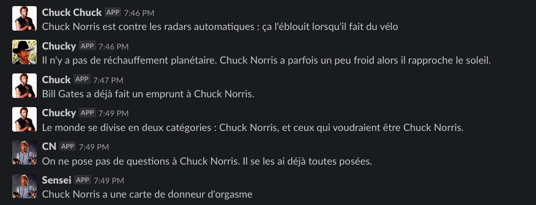

# Chuck Norris API

Welcome to this wonderful project!

Given a [FLIC connected button](https://flic.io/), provides awesome random facts from Chuck Norris legend.
This project is based on [chucknorrisfacts API](http://chucknorrisfacts.fr/api/).

This project aims to help members of a team to relax during hard days.



## Test

Feel free to run tests with this command below

```bash
npm test
```

## Setup & Deploy!

This project has been deployed with [Heroku](https://www.heroku.com/)

There are some things to consider

### Generate Slack token

Rendez-vous on your [slack configuration](https://slack.com/intl/en-gb/help/articles/215770388-Create-and-regenerate-API-tokens) to generate a token

### Create environment variables

This project needs 3 environment variables in order to work:

* `FLIC_AUTHENTICATION` this token is your own, you can generate it or whatever,
but it must be fill as _CUSTOM HEADER_ in order to work.
The expected header is: `x-live-button-token`
* `SLACK_TOKEN` must be fill with previous generated Slack token
* `SLACK_CHANNEL_ID` targeted Slack channel, can be found in the URL from online Slack mode.

### Configure the call

There's only one endpoint on this project: `GET <URI>/chuck-norris`.
Don't forget to add the _CUSTOM HEADER_ and enjoy!

And also don't forget:

> Chuck Norris voit le temps passer.
